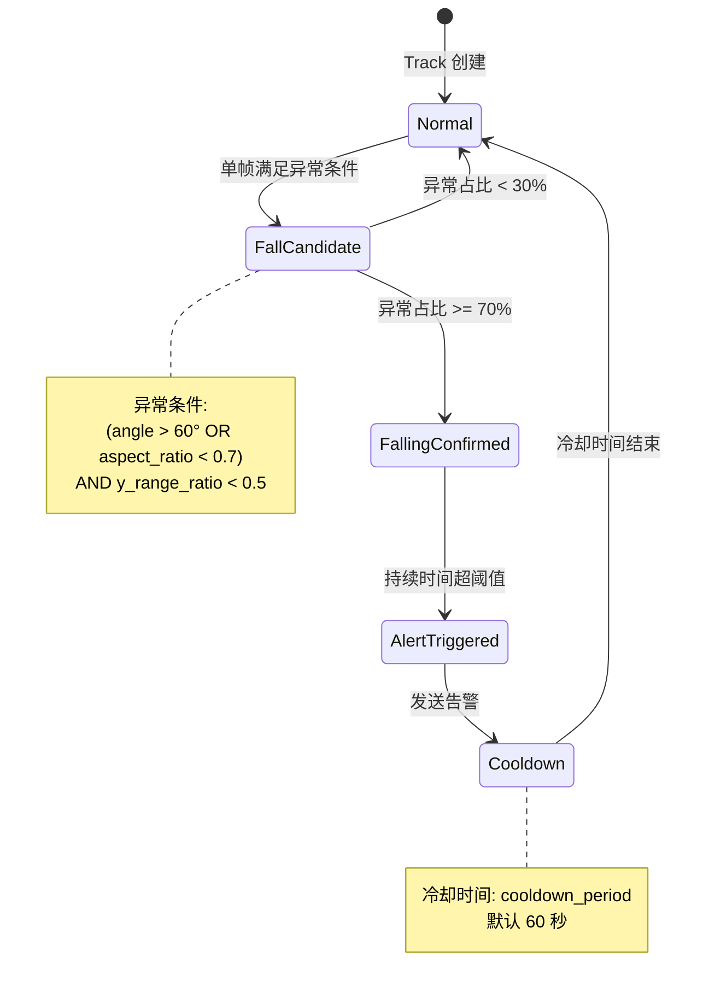

# 行人摔倒检测任务判定逻辑说明

## 背景
实现一个基于视频流的行人摔倒检测任务。使用 YOLO-Pose 对视频流中每一帧输出人体 bounding box、人体关键点坐标及置信度。由于摔倒不是一个单纯的"姿态"，而是一个"姿态 + 时间变化"的事件，单帧判断几乎必然误报，因此需要设计一套基于多特征联合与时间一致性的判定逻辑。

## 目标
- 在视频流中稳定、准确地识别**人员摔倒**行为
- 区分摔倒与正常行走、弯腰、下蹲、坐下等常见动作
- 降低因模型不稳定、单帧误判带来的误报率
- 确保告警触发逻辑具备时序一致性和可解释性
- 支持在 ROI 场景下的定点监管需求

## 约束
- 不允许仅基于单帧姿态结果直接触发告警
- 不允许对 ROI 区域外的目标进行摔倒判定
- 必须基于目标跟踪（Track ID）进行时序判定
- 告警策略需具备参数化能力（阈值、窗口大小等）
- 判定策略应多特征联合，单一特征不可靠

## 输出要求
- 清晰说明整体处理流程与各阶段逻辑
- 明确摔倒检测的最终判定条件
- 给出基于 Track ID 的时序判定机制
- 提出有助于提升稳定性和工程效果的合理建议

---

## 任务判定流程说明

### 1. 人体姿态检测
- 对视频流中的每一帧执行 YOLO-Pose 目标检测(使用 `model/model_yolo11m_pytorch.py` 模型推理脚本)
- 从检测结果中获取：
  - 人体 Bounding Box（x1, y1, x2, y2）
  - 人体关键点坐标（YOLO-Pose 标准 0-based 索引）
    - 0: Nose（鼻子）
    - 1: Left Eye（左眼）
    - 2: Right Eye（右眼）
    - 3: Left Ear（左耳）
    - 4: Right Ear（右耳）
    - 5: Left Shoulder（左肩）
    - 6: Right Shoulder（右肩）
    - 7: Left Elbow（左肘）
    - 8: Right Elbow（右肘）
    - 9: Left Wrist（左腕）
    - 10: Right Wrist（右腕）
    - 11: Left Hip（左髋）
    - 12: Right Hip（右髋）
    - 13: Left Knee（左膝）
    - 14: Right Knee（右膝）
    - 15: Left Ankle（左踝）
    - 16: Right Ankle（右踝）
  - 每个关键点的置信度（0.0 ~ 1.0）

### 2. 置信度与 ROI 区域过滤

#### 2.1 关键点置信度过滤
选取与摔倒判定相关的 8 个核心关键点进行置信度检查：
- 关键点索引：5(左肩)、6(右肩)、11(左髋)、12(右髋)、13(左膝)、14(右膝)、15(左踝)、16(右踝)

**平均置信度计算公式**：
```
avg_conf = sum(8个关键点置信度) / 8
若 avg_conf < detect_conf，则忽略该目标
```

#### 2.2 ROI 区域过滤
- 对满足置信度要求的目标，判断其中心点是否位于预先配置的 ROI 区域内
- 若目标的检测框中心点不在任何 ROI 区域内，则不进入后续逻辑

### 3. 人员目标跟踪
- 对通过检测的人员目标进行多目标跟踪（BYTETracker）
- 为每个目标分配唯一的 `track_id`
- 后续所有判定逻辑均以 `track_id` 作为时序关联的唯一标识

### 4. 关键判定指标计算

#### 4.1 人体纵横比变化（姿态角度）
- 使用人体 bounding box 计算：
  - `width = x2 - x1`
  - `height = y2 - y1`
  - `aspect_ratio = height / width`
- 判定逻辑：
  - 正常站立/行走：`aspect_ratio` 较大（偏竖直）
  - 摔倒/躺倒：`aspect_ratio` 显著下降（偏水平）
  - 经验阈值：`aspect_ratio < 0.7` → 疑似横躺姿态

#### 4.2 人体主轴倾斜角度（关键点几何）
- 选取**肩部中点**与**髋部中点**构成人体主轴向量
- 计算该向量与垂直方向的夹角 θ

**具体计算公式**：
```python
# 肩部中点（使用关键点索引 5 和 6）
shoulder_mid_x = (keypoints[5].x + keypoints[6].x) / 2
shoulder_mid_y = (keypoints[5].y + keypoints[6].y) / 2

# 髋部中点（使用关键点索引 11 和 12）
hip_mid_x = (keypoints[11].x + keypoints[12].x) / 2
hip_mid_y = (keypoints[11].y + keypoints[12].y) / 2

# 主轴向量（从肩部指向髋部）
dx = hip_mid_x - shoulder_mid_x
dy = hip_mid_y - shoulder_mid_y

# 与垂直方向的夹角（垂直方向为 y 轴正方向）
# 使用 atan2 计算角度，结果范围 [0°, 90°]
angle = abs(math.atan2(dx, dy) * 180 / math.pi)
```

- 判定逻辑：
  - 正常站立：θ 接近 0°（主轴近似垂直）
  - 摔倒/躺倒：θ 接近 90°（主轴近似水平）
  - 经验阈值：`θ > 60°` → 姿态明显倾斜

#### 4.3 关键点高度分布压缩
- 统计该人体所有关键点的 y 坐标
- 计算当前帧的高度范围：`y_range = max(y) - min(y)`

**高度压缩比计算方式**：

采用基于 bounding box 高度的相对比值方法：
```python
# 当前帧关键点 y 坐标范围
y_range = max(keypoint_y_values) - min(keypoint_y_values)

# bbox 高度作为参考基准
bbox_height = y2 - y1

# 高度压缩比（相对值）
y_range_ratio = y_range / bbox_height

# 判定条件
若 y_range_ratio < y_range_compression (0.5)，则判定为高度压缩
```

- 判定逻辑：
  - 站立时：`y_range_ratio` 接近 1.0（关键点分布覆盖整个 bbox 高度）
  - 躺倒时：`y_range_ratio` 显著变小（关键点高度集中，通常 < 0.5）

### 5. 基于 Track ID 的时序判定机制

#### 5.1 状态缓存维护

```
数据结构:
{
  track_id_1: {
    aspect_ratios: [1.2, 1.1, 0.6, 0.5, ...],     # 纵横比历史
    angles: [10, 15, 45, 70, ...],                # 主轴角度历史
    y_range_ratios: [0.9, 0.85, 0.6, 0.4, ...],   # 关键点高度压缩比历史
    status: "normal" | "falling"                  # 当前姿态状态
  },
  track_id_2: {...},
  ...
}
```

为每个 `track_id` 维护最近 N 帧的：
- `aspect_ratio` 纵横比（bbox 高度/宽度）
- `angle` 主轴角度 θ（肩-髋连线与垂直方向夹角）
- `y_range_ratio` 关键点高度压缩比（关键点 y 范围 / bbox 高度）
- `status` 当前姿态状态（normal / falling）

#### 5.2 单帧异常姿态判定

对于每一帧，判定该帧是否为"异常姿态帧"。**需同时满足以下两个条件（AND 关系）**：

```
单帧异常姿态条件（同时满足）：
├── 条件1: 姿态倾斜
│   └── (angle > 60°) OR (aspect_ratio < 0.7)
│
└── 条件2: 高度压缩
    └── y_range_ratio < 0.5
```

满足上述条件的帧被标记为 **Fall Candidate Frame（摔倒候选帧）**。

#### 5.3 时间一致性确认（防误报）
为了避免误判，需要在时间维度上进行一致性验证：

**异常帧占比计算**：
```
异常帧数量 = 最近 N 帧中满足"单帧异常姿态条件"的帧数
异常帧占比 = 异常帧数量 / N

若 异常帧占比 >= vio_threshold / history_queue（即 14/20 = 70%）
→ 通过时间一致性验证
```

- 历史队列长度 N = `history_queue`（默认 20 帧）
- 违规阈值 = `vio_threshold`（默认 14 帧）
- 即：最近 20 帧中至少有 14 帧（70%）为异常姿态帧，才进入最终判定

#### 5.4 状态转换流程图



**状态说明**：
| 状态 | 含义 |
|------|------|
| Normal | 正常状态，姿态无异常 |
| FallCandidate | 摔倒候选，单帧检测到异常姿态 |
| FallingConfirmed | 摔倒确认，通过时间一致性验证 |
| AlertTriggered | 告警触发，已发送告警消息 |
| Cooldown | 冷却状态，避免重复告警 |

### 6. 最终摔倒判定逻辑

#### 6.1 摔倒确认条件
对每个 `track_id`，判定为摔倒，**当且仅当**：
1. 姿态从竖直 → 明显倾斜或水平（由 `Normal` 转为 `FallingConfirmed` 状态）
2. 当前异常姿态在多帧中持续存在（异常姿态在最近 N 帧中占比 >= 70%）
3. 排除短时弯腰/下蹲等可恢复姿态（通过时间一致性验证实现）

#### 6.2 状态恢复条件
当 `track_id` 从 `FallCandidate` 或 `FallingConfirmed` 状态恢复为 `Normal` 状态的条件：

```
状态恢复条件（满足任一）：
├── 条件1: 异常帧占比过低
│   └── 异常帧占比 < 30%（即最近 20 帧中异常帧少于 6 帧）
│
└── 条件2: 连续正常帧数达标
    └── 连续 M 帧（建议 M = min_confirm）检测到正常姿态
```

**恢复逻辑说明**：
- 短暂的姿态恢复（如仅 1-2 帧正常）不会立即重置状态
- 需要持续检测到正常姿态，才会恢复为 `Normal` 状态
- 这避免了因检测抖动导致的状态频繁切换

### 7. 告警触发
- 当目标被稳定判定为摔倒，且满足持续帧数/时间阈值要求时
- 发送摔倒告警消息
- 同一 `track_id` 可设置告警冷却时间，避免重复告警

---

## 合理建议

1. **必须使用 Track ID**
   - 单帧判断几乎必然误报，时序分析是摔倒检测的核心

2. **多指标联合判定**
   - 综合使用 aspect_ratio + angle + 时间一致性
   - 单一阈值不可靠

3. **引入"状态确认帧"机制**
   - 在目标刚出现的前若干帧内不参与摔倒判定，减少初始误判
   - 推荐：`min_confirm = 5~10`

4. **结合目标可见性条件**
   - 对遮挡严重、关键点置信度过低的目标可暂缓判定
   - 建议设置最小关键点可见数量阈值

5. **结合 ROI 区域**
   - 仅在地面/走廊/危险区域启用摔倒检测
   - 减少不相关区域的误报

6. **告警冷却机制**
   - 同一 `track_id` 在短时间内只触发一次摔倒告警
   - 避免重复告警造成干扰

---

## 总结
通过"目标检测 + ROI 过滤 + 目标跟踪 + 多特征联合判定 + 基于 Track ID 的时序一致性验证"，该摔倒检测逻辑能够有效区分真实摔倒与正常动作（弯腰、下蹲、坐下），在保证实时性的同时显著提升整体系统的稳定性与工程可靠性。

---

## 关键参数配置示例

```python
CONFIG = {
    # ==================== 检测参数 ====================
    "detect_conf": 0.6,           # YOLO-Pose 检测置信度阈值
                                  # 8个核心关键点的平均置信度需 >= 此值

    # ==================== 跟踪参数 ====================
    "max_age": 30,                # 跟踪目标最大丢失帧数
    "min_hits": 3,                # 最小连续检测帧数
    "min_confirm": 5,             # Track 稳定确认帧数
                                  # 目标需持续出现 5 帧后才参与摔倒判定
    "max_missing": 3,             # Track 丢失容忍帧数

    # ==================== 姿态判定参数 ====================
    "aspect_ratio": 0.7,          # 纵横比阈值
                                  # bbox 高度/宽度 < 0.7 时判定为疑似躺倒

    "vertical_angle": 60,         # 主轴倾斜角度阈值（度）
                                  # 肩-髋连线与垂直方向夹角 > 60° 时判定为姿态倾斜

    "y_range_compression": 0.5,   # 关键点高度压缩阈值（相对比值）
                                  # y_range_ratio = 关键点y范围 / bbox高度
                                  # 当 y_range_ratio < 0.5 时判定为高度压缩

    # ==================== 时序判定参数 ====================
    "history_queue": 20,          # 历史队列长度（帧数）
                                  # 用于计算异常帧占比的滑动窗口大小

    "vio_threshold": 14,          # 违规判定阈值（帧数）
                                  # 最近 20 帧中至少 14 帧为异常姿态帧
                                  # 即异常帧占比 >= 14/20 = 70% 才确认摔倒

    # ==================== 告警参数 ====================
    "cooldown_period": 60,        # 告警冷却时间（秒）
                                  # 同一 track_id 触发告警后，60秒内不再重复告警
}
```

**参数关系说明**：
- `vio_threshold` / `history_queue` = 异常帧占比阈值（默认 14/20 = 70%）
- 可根据实际场景调整：
  - 提高占比阈值（如 80%）：减少误报，但可能漏报
  - 降低占比阈值（如 60%）：提高灵敏度，但可能增加误报
